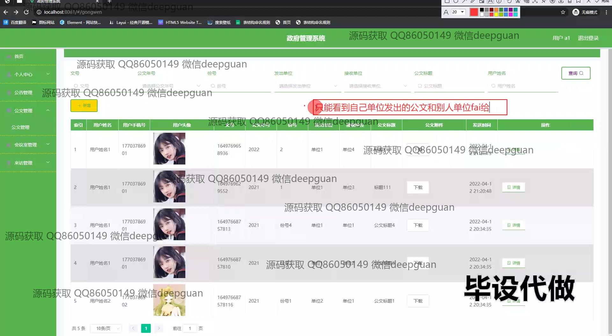

<h1 align="center">基于springBoot政府管理的系统设计</h1>

## 简介
基于Spring Boot开发的政府管理系统：角色分为用户和管理员，涵盖单位管理、公文管理、留言管理、会议预约、信访登记等功能，以提升政府事务电子化管理效率。    --计算机毕业设计源码；毕设源码；java毕业设计源码

## 联系方式

<h3 align="center">获取完整代码与数据库文件 + 微信：deepguan QQ: 86050149 QQ群: 783742310</h3>

<h3 align="center">可帮忙远程部署 包运行成功！提供远程部署、修改代码、设计文档指导、代码讲解等服务！</h3>

## 功能介绍（完整见运行截图）
管理员：管理政府单位和用户信息，通过系统提供的单位、公文、会议和用户管理模块实现对各类信息的高效管理和操作；能够查看、添加、编辑和删除用户信息，管理公文的生成与传输，查看和安排会议室使用，简化全局管理流程；处理留言和信访请求，并进行状态跟踪和记录，确保消息被及时处理和反馈。

用户：通过个人中心模块查看和更新个人信息，如账号、用户名、联系方式等；使用系统的公文管理功能进行公文的查找、下载和详细信息查看，方便处理日常公文事务；通过会议管理模块完成会议预约、查看预约详情和编辑会议安排等，简化会议管理；访问来访和信访管理模块，查看和处理信访事务，保障信息流畅。

## 运行截图

本代码来源于网络,仅供学习参考使用!

